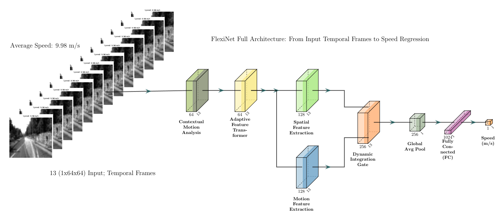
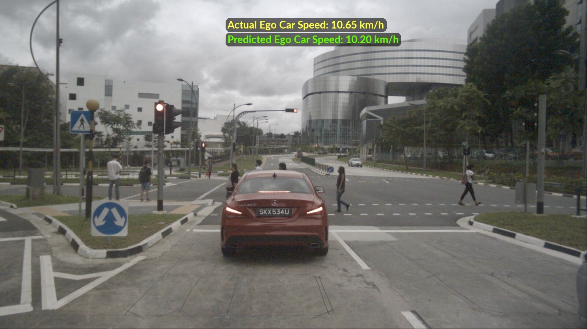

<div align="center">



# FlexiNet: An Adaptive Feature Synthesis Network for Real-Time Ego Vehicle Speed Estimation

**Abdalrahman Ibrahim**$^1$, **Kyandoghere Kyamakya**$^1$, **Wolfgang Pointner**$^2$

$^1$*Transportation Informatics, University of Klagenfurt* <br>
$^2$*AGILOX Services GmbH*

[](https://ieeexplore.ieee.org/document/your_link_here)
[](LICENSE)
[](https://pytorch.org/)

</div>

<p align="center">
  
</p>

---

## 🚀 Introduction

**FlexiNet** is a state-of-the-art deep learning model designed for **accurate, real-time ego vehicle speed estimation** using monocular camera data. Accepted for publication in **IEEE Access 2025**, FlexiNet addresses the critical challenge of estimating speed in dynamic and unstructured environments where traditional wheel odometry and GPS often fail.

Our approach introduces a novel **Adaptive Feature Synthesis** mechanism that dynamically weights spatial and temporal features, ensuring robust performance across varying driving conditions—from high-speed highways to complex urban maneuvers.

### Key Features
- **🏆 State-of-the-Art Accuracy**: Outperforms existing baselines on **KITTI** and **nuImages** datasets.
- **⚡ Real-Time Performance**: Optimized for low-latency inference on automotive embedded hardware.
- **🧠 Adaptive Architecture**:
    - **Contextual Motion Analysis Block (CMAB)**: Captures global motion context.
    - **Adaptive Feature Transformer (AFT)**: Dynamically attends to critical temporal frames.
    - **Sanity-Aware Integration**: Fuses spatial and temporal cues intelligently.
- **🔌 Deployment Ready**: Full **ONNX** support for seamless production integration.

## 📰 News
- **[2025/02]** 🌟 **Paper Accepted!** FlexiNet will be published in **IEEE Access 2025**.
- **[2025/02]** 🚀 **Code Release**: Official PyTorch implementation and pretrained models are now available.

## 🏗️ Architecture

FlexiNet is composed of five synergistic components:
1.  **Spatial Feature Extraction Module (SFEM)**: Utilizing a lightweight ResNet backbone to capture static scene details.
2.  **Motion Feature Extraction Module (MFEM)**: Capturing temporal dynamics from optical flow.
3.  **Contextual Motion Analysis Block (CMAB)**: Analyzing global motion patterns to filter noise.
4.  **Adaptive Feature Transformer (AFT)**: A Transformer-based module that refines temporal features.
5.  **Dynamic Integration Gate**: A learned gating mechanism to optimally fuse spatial and temporal streams.

## 📊 Model Zoo & Benchmarks

We provide pretrained models for both **nuImages** and **KITTI** datasets.

| Model | Dataset | Loss | RMSE (m/s) $\downarrow$ | MAE (m/s) $\downarrow$ | Download |
| :--- | :---: | :---: | :---: | :---: | :---: |
| FlexiNet-Nu-L1 | nuImages | L1 | **1.135** | **0.959** | [Link](#) |
| FlexiNet-Nu-L2 | nuImages | L2 | 1.142 | 0.965 | [Link](#) |
| FlexiNet-KITTI-L1 | KITTI | L1 | **1.954** | **1.061** | [Link](#) |
| FlexiNet-KITTI-L2 | KITTI | L2 | 1.960 | 1.070 | [Link](#) |

> **Note**: Minimizing RMSE is critical for safety-critical applications. Our L1-trained models consistently show the best robust performance.

## ⚙️ Installation

### Prerequisites
- Linux / macOS / Windows
- Python >= 3.8
- PyTorch >= 1.10
- CUDA (for GPU acceleration)

### Setup
```bash
git clone https://github.com/Geekgineer/FlexiNet.git
cd FlexiNet
pip install -r requirements.txt
```

## 📂 Data Preparation

Please organize your datasets as follows to ensure compatibility with our training scripts:

```text
FlexiNet/
└── data/
    ├── kitti/
    │   ├── train/
    │   └── valid/
    └── nuscenes/
        ├── nuimages-v1.0-all-metadata/
        ├── nuimages-v1.0-all-samples/
        └── nuimages-v1.0-all-sweeps-cam-front/
```

## 🖥️ Usage

### 1. Training
Train FlexiNet from scratch using our optimized training script:
```bash
bash run_train.sh
```

### 2. Evaluation
Evaluate the model on the test set:
```bash
bash run_test.sh
```

### 3. Inference & Visualization
Run inference on a video or camera stream:
```bash
python generate_vis.py 
```


### 4. ONNX Export
Export the trained model for deployment:
```bash
python onnx_export/export.py --model pretrained_models/checkpoint_epoch_100_nuimage_L1_best.pth
```

## 📜 Citation

If you use FlexiNet in your research, please cite our work:

```bibtex
@article{FlexiNet2025,
  title={FlexiNet: An Adaptive Feature Synthesis Network for Real-Time Ego Vehicle Speed Estimation},
  author={Ibrahim, Abdalrahman and Kyamakya, Kyandoghere and Pointner, Wolfgang},
  journal={IEEE Access},
  year={2025},
  publisher={IEEE}
}
```

## 📄 License

This project is licensed under the **GPLv3 License**. See the [LICENSE](LICENSE) file for details.

## 🙏 Acknowledgments

This work was supported by **The University of Klagenfurt** and **AGILOX Services GmbH**. We thank the creators of the KITTI and nuImages datasets for providing the data necessary for this research.

---
<div align="center">
 By the Transportation Informatics Group AAU
</div>
